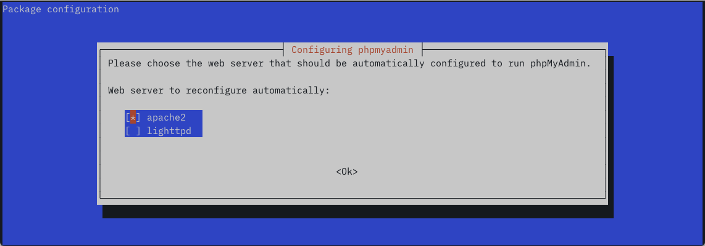
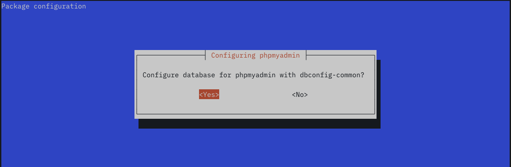
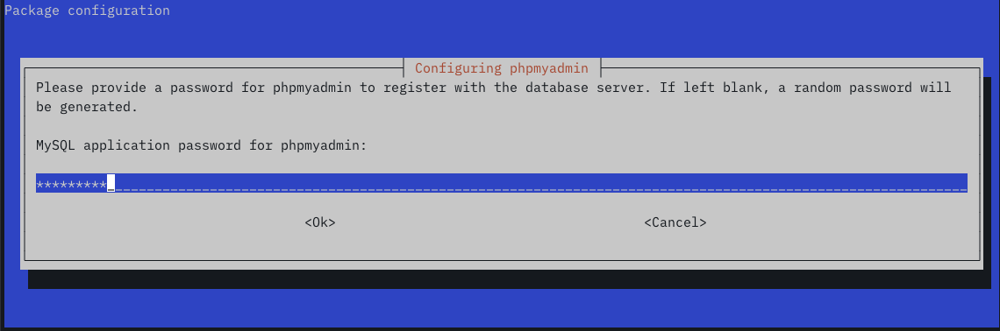
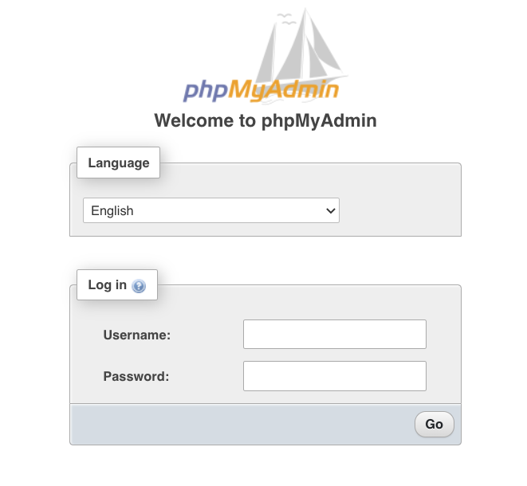

## What is phpMyAdmin?

phpMyAdmin is a web-based administration tool for MySQL and MariaDB databases. It is a PHP-based tool that simplifies database management with a graphical interface while allowing users to leverage the power of SQL. 

This guide explains how to install, configure, and secure phpMyAdmin on Debian 11 "bullseye". 

## Before You Begin

1.  Familiarize yourself with our [Getting Started](/docs/getting-started/) guide and complete the steps for setting your Linode's hostname and timezone.

    Verify your hostname:

        hostname
        hostname -f

    The first command should display your short hostname, and the second should display a fully qualified domain name (FQDN).

2.  Follow our [Securing Your Server](/docs/security/securing-your-server/) guide to create a standard user account, harden SSH access, and remove unnecessary network services.

3.  This guide assumes you have a working LAMP stack. Follow [Install a LAMP Stack on Debian 10 (Buster)](/docs/guides/how-to-install-a-lamp-stack-on-debian-10/) to install and configure Apache, MariaDB, and PHP.

4.  We recommend installing an SSH certificate and accessing phpMyAdmin via an HTTPS connection. Otherwise, phpMyAdmin authentication credentials are sent in plaintext. To install a free Let's Encrypt certificate, complete the steps described in [Securing Web Traffic Using Certbot with Apache on Debian](/docs/guides/enabling-https-using-certbot-with-apache-on-debian/).

5.  Update your system:

        sudo apt update && sudo apt upgrade


This guide is written for a non-root user. Commands that require elevated privileges are prefixed with `sudo`. If you’re not familiar with the `sudo` command, see the [Users and Groups](/docs/tools-reference/linux-users-and-groups/) guide.


## Install phpMyAdmin on Debian 11

1.  Install phpMyAdmin from the Debian 11 repositories:

        sudo apt install phpmyadmin

2.  Select `apache2` in the installation script interface: 

    

3.  Select `Yes` to install `db-config-common`:

    

4.  Enter a database password for phpMyAdmin to use:

    

5.  If you are using Apache virtual hosts, create a symbolic link from the virtual host's document root to the phpMyAdmin installation directory.  

        cd /var/www/html/example.org/public_html
        sudo ln -s /usr/share/phpmyadmin

6. Test your Debian 11 phpMyAdmin installation. Visit phpMyAdmin in a web browser at `https://example.com/phpmyadmin`. You should see the phpMyAdmin log-in page. Enter your MySQL root user credentials or the credentials of another MySQL user to log in.

    

    

## Secure phpMyAdmin on Debian 11

### Restrict Access by IP Address

With the current configuration, the phpMyAdmin log-in page is accessible to anyone on the web. However, you can use the site's virtual host configuration file to restrict access to specific IP addresses. 

Open your virtual host's configuration and add a `Location` block. Replace `example.com` with the relevant domain and `203.0.113.0` with the IP address from which you will access phpMyAdmin. You can add multiple IP address by adding more `Require ip` lines. 

    sudo vim /etc/apache2/sites-available/example.com.conf


<Location />
    Require ip 203.0.113.0
</Location>


### Force SSL

You can require phpMyAdmin users to access it via a secure HTTPS connection. Forcing SSL prevents authentication credentials from being sent unencrypted. If you're using a Let's Encrypt certificate,  `certbot` sets up HTTPS redirects automatically. However, if you installed the certificate manually, you can add the following line to the `<VirtualHost *:80>` section of your site's virtual hosts configuration file.


Redirect permanent / https://example.com/
