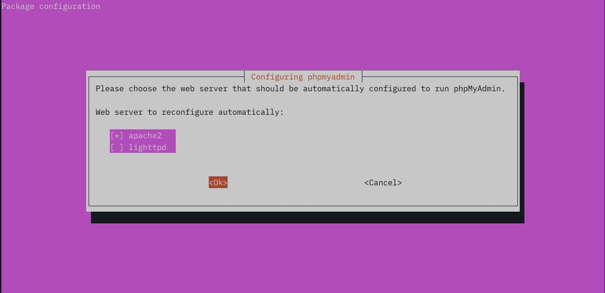
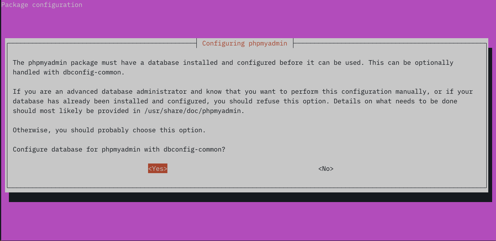
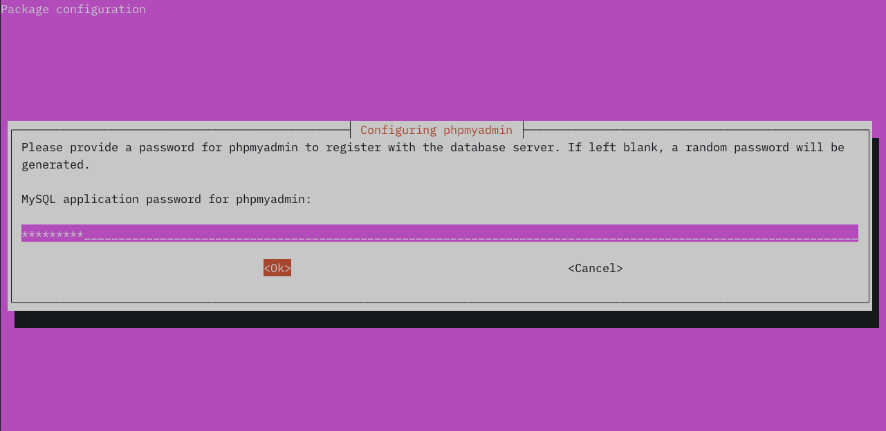
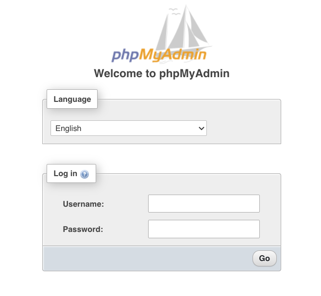

## What is phpMyAdmin?

phpMyAdmin is a PHP-based database administration tool for MySQL and MariaDB. It allows users to manage databases in their web browser. phpMyAdmin provides simple graphical database management and visualization tools while allowing power users to access the full capabilities of SQL. 

This guide explains how to install, configure, and secure phpMyAdmin on Ubuntu 20.04 LTS. 

## Before You Begin

1.  Familiarize yourself with our [Getting Started](/docs/getting-started/) guide and complete the steps for setting your Linode's hostname and timezone.

    Verify your hostname:

        hostname
        hostname -f

    The first command should display your short hostname, and the second should display a fully qualified domain name (FQDN).

2.  Follow our [Securing Your Server](/docs/security/securing-your-server/) guide to create a standard user account, harden SSH access, and remove unnecessary network services.

3.  This guide assumes you have a working LAMP stack. Follow [How to Install a LAMP Stack on Ubuntu 20.04](/docs/guides/how-to-install-a-lamp-stack-on-ubuntu-20-04/) to install and configure Apache, MySQL, and PHP.

4.  Optionally, install an SSL certificate to secure connections between the browser and phpMyAdmin. To install a free Let's Encrypt certificate, complete the steps described in [Securing Web Traffic Using Certbot with Apache on Ubuntu 20.04](/docs/guides/enabling-https-using-certbot-with-apache-on-ubuntu/).

5.  Update your system:

        sudo apt update && sudo apt upgrade


This guide is written for a non-root user. Commands that require elevated privileges are prefixed with `sudo`. If you’re not familiar with the `sudo` command, see the [Users and Groups](/docs/tools-reference/linux-users-and-groups/) guide.


## Install phpMyAdmin on Ubuntu 20.04

1.  Install the `mcrypt` PHP module:

        sudo apt install mcrypt

2.  Install phpMyAdmin from the Ubuntu 20.04 repositories:

        sudo apt install phpmyadmin

3.  Select `apache2` in the installation script interface: 

    

4.  Select `Yes` to install and configure the database with `dbconfig-common`:

    

5.  Enter a database password for phpMyAdmin to use:

    

6.  Create a symbolic link from the virtual host's document root to the phpMyAdmin installation directory.  

        cd /var/www/html/example.org/public_html
        sudo ln -s /usr/share/phpmyadmin

6. Add a MySQL user with elevated privileges. With the current configuration, you will not be able to log in to phpMyAdmin as the MySQL root user. First, log in to MySQL as the root user:

        mysql -u root

8.  Enter the following SQL, replacing `new-user` and `secure-password` with applicable credentials:

        CREATE USER 'new-user'@'%' IDENTIFIED BY 'secure-password';
        GRANT ALL PRIVILEGES ON *.* TO 'new_user'@'%' WITH GRANT OPTION;
        FLUSH PRIVILEGES;
        exit

7. Test your Ubuntu 20.04 phpMyAdmin installation. Visit phpMyAdmin in a web browser at `https://example.com/phpmyadmin`. You should see the phpMyAdmin log-in page. Enter your new MySQL user's credentials or the credentials of another MySQL user.

    

## Secure phpMyAdmin on Ubuntu 20.04

### Restrict Access by IP Address

With the current configuration, the phpMyAdmin log-in page is accessible to anyone on the web. However, you can use the site's virtual host configuration file to restrict access to specific IP addresses. 

Open your virtual host's configuration and add a `Location` block. Replace `example.com` with the relevant domain and `203.0.113.0` with your local IP address. You can add multiple IP address by adding more `Require ip` lines. 

    sudo vim /etc/apache2/sites-available/example.com.conf


<Location />
    Require ip 203.0.113.0
</Location>


### Force SSL

You can require phpMyAdmin users to access it via a secure HTTPS connection. Forcing SSL prevents authentication credentials from being sent unencrypted. If you're using a Let's Encrypt certificate,  `certbot` sets up HTTPS redirects automatically. However, if you installed the certificate manually, you can add the following line to the `<VirtualHost *:80>` section of your site's virtual hosts configuration file.


Redirect permanent / https://example.com/
