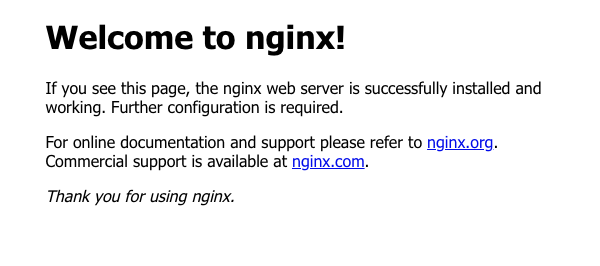
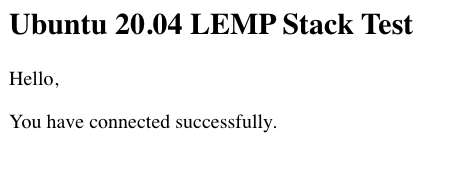
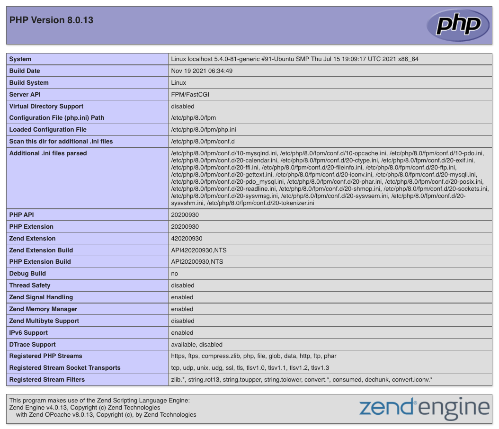

## What is the LEMP Stack on Ubuntu 20.04 LTS

The LEMP stack is a server configuration used to host websites and web applications based on the PHP programming language. A LEMP stack comprises four main components: 

* The Linux operating system, in this case, the Ubuntu 20.04 LTS distribution,
* The NGINX web server and reverse proxy,
* The MariaDB database management system, and 
* The PHP programming language. 

This guide explains how to install a LEMP stack on a Linode running Ubuntu 20.04. Deploying a Linode with Ubuntu takes care of the "L" in LEMP, so the guide focuses on installing, configuring, and testing the other components.

### What Is the Difference Between LAMP and LEMP?
A LAMP stack is an alternative server configuration that uses the Apache web server instead of NGINX. Like the LEMP stack, it also uses Linux, MariaDB (or MySQL), and PHP. Apache and NGINX are the web's dominant servers. Each has advantages and disadvantages, which you can learn more about from [A Comparison of the NGINX and Apache Web Servers](https://www.linode.com/docs/guides/comparing-nginx-and-apache-web-servers/).

## Before You Begin

1.  Familiarize yourself with our [Getting Started](/docs/getting-started/) guide and complete the steps for setting your Linode's hostname and timezone.

2.  This guide will use `sudo` wherever possible. Complete the sections of our [Securing Your Server](/docs/security/securing-your-server/) to create a standard user account, activate the `ufw` firewall, harden SSH access, and remove unnecessary network services. 

3.  Update your system:

        sudo apt update && sudo apt upgrade


This guide is written for a non-root user. Commands that require elevated privileges are prefixed with `sudo`. If you’re not familiar with the `sudo` command, see the [Users and Groups](/docs/tools-reference/linux-users-and-groups/) guide.


## Installing a LEMP Stack on Ubuntu 20.04 LTS

### Install NGINX

NGINX is the web server which will respond to HTTP requests and serve web pages to users. 

1.  Install NGINX from the Ubuntu repositories:

		sudo apt install nginx
		
2. NGINX starts automatically. Verify that it is up and running:

		sudo systemctl status nginx
		
	
● nginx.service - A high performance web server and a reverse proxy server
	Loaded: loaded (/lib/systemd/system/nginx.service; enabled; vendor preset: enabled)
	Active: active (running) since Sat 2021-11-20 14:00:12 UTC; 1min 30s ago
	
	
3.  If you have enabled the `ufw` firewall on your Linode, you must add firewall rules to allow HTTP requests on port 80:

		sudo ufw allow http
		sudo ufw reload
		
4.  Navigate to your Linode's IP address or domain name in a web browser. For example, type `http://198.51.100.0` or `http://example.com` in your browser's address bar, replacing the example IP or domain name with the details applicable to your server. You should see the default NGINX page.

	
	
Learn more about NGINX on Ubuntu in [Installing and Using NGINX on Ubuntu 20.04](/docs/guides/how-to-install-and-use-nginx-on-ubuntu-20-04/)

### Install MariaDB
1. Install MariaDB:

		sudo apt install mariadb-server 
		
2.  Secure the MariaDB installation. The `mysql_secure_installation` script prompts you to create a password for the root user. It then asks a series of questions. You should respond 'Y' to each question.

		mysql_secure_installation
		
	
Set root password? [Y/n]
Remove anonymous users? [Y/n]
Disallow root login remotely? [Y/n]
Remove test database and access to it? [Y/n]
Reload privilege tables now? [Y/n]
	
	 	
3.  Log in to the MariaDB shell as the root user.  You won't be asked for the MariaDB root password. The default authentication mechanism allows system users with `sudo` privileges to log in as root without a password. In fact, only these users can authenticate as root, so we add an ordinary MariaDB user with restricted privileges for PHP applications to use. 

		sudo mysql

4.  Create a test database and a user with permission to access it. Replace `testdb` and `testuser` with names appropriate to your project. Replace `password` with a strong password. 

	
CREATE DATABASE testdb;
CREATE USER 'testuser' IDENTIFIED BY 'password';
GRANT ALL PRIVILEGES ON testdb.* TO 'testuser';
quit
	
	
### Install PHP

The default Ubuntu 20.04 repositories include PHP 7.4. They do not include the most recent version: PHP 8.0. To install PHP 8, we'll add the `ondrej/php` PPA to Ubuntu's software sources. 

1. Enable the `ondrej/php` PPA and download the package data: 

		sudo add-apt-repository ppa:ondrej/php
		sudo apt update
		
2.  Install the PHP FastCGI Processing Manager (php-fpm), which will also install core PHP dependencies:

		sudo apt install php8.0-fpm
		
3.  Install `php8.0-mysql`, a PHP extension for working with the MySQL and MariaDB databases:

		sudo apt install php8.0-mysql
		
## Configure NGINX to Work with PHP

1. Create a directory from which your site's files will be served. We'll use `example.com` in the following steps. Replace it with your site's domain name. 

		sudo mkdir /var/www/example.com
		
2. Change the ownership of this directory to your user. Replace `USER` with your ordinary username. 

		sudo chown -R USER:USER /var/www/example.com
		
3. Create a new NGINX configuration file with your preferred text editor. This file contains the server block configuration NGINX needs to serve your site's files. 

		sudo nano /etc/nginx/sites-available/example.com
		
	Copy the below server block configuration to the new file, replacing `example.com` with your domain.

	
server {
   listen 80;
   server_name example.com www.example.com;
   root /var/www/example.com;

   index index.html index.htm index.php;

   location / {
       try_files $uri $uri/ =404;
   }

   location ~ \.php$ {
       include snippets/fastcgi-php.conf;
       fastcgi_pass unix:/var/run/php/php8.0-fpm.sock;
    }

   location ~ /\.ht {
       deny all;
   }

}
	

4.  Link to the new configuration file from NGINX's `site-enabled` directory:

		sudo ln -s /etc/nginx/sites-available/example.com /etc/nginx/sites-enabled/
		
5.  Remove the link to the default configuration file:

		sudo unlink /etc/nginx/sites-enabled/default
		
6.  Verify that the new configuration file is free from errors:

		sudo nginx -t
		
	If NGINX reports errors in the configuration file, ensure you copied the example file listing correctly.  When editing the domain details, take care not to remove or overwrite the existing syntax.   
		
7.  Reload NGINX and PHP to take your changes live:

		sudo systemctl reload php8.0-fpm
		sudo systemctl reload nginx
		
## Test the Ubuntu LEMP Stack

Finally, we'll add a PHP test page to the site directory to check NGINX, MySQL, and PHP are working as expected. 

1.  Create the test page with the following contents. Replace `testuser` and `password` with the MySQL credentials you created above. 

		nano /var/www/example.com/test.php
		
			
<html>
<head>
    <h2>LEMP Stack Test</h2>
</head>
    <body>
    <?php echo '
Hello,
';

    // Define PHP variables for the MySQL connection.
    $servername = "localhost";
    $username = "testuser";
    $password = "password";

    // Create a MySQL connection.
    $conn = mysqli_connect($servername, $username, $password);

    // Report if the connection fails or is successful.
    if (!$conn) {
        exit('
Your connection has failed.
' .  mysqli_connect_error());
    }
    echo '
You have connected successfully.
';
    ?>
</body>
</html>


2. Visit `http://example.com/test.php` in your web browser, replacing `example.com` with your domain name. All being well, the page will load and report that you connected successfully. 

	

3.  To further verify that PHP is working and that the correct version is installed and active, create a PHP info file:

		nano /var/www/example.com/info.php

	
<?php
	phpinfo();
?>


4. Visit `http://example.com/info.php` in your browser. You should see a PHP info page with detailed information about the PHP version running on your Linode. 

	
	
5. Delete both test pages. The PHP Info Page reveals details about your PHP installation that could be useful to an attacker, so be sure to remove it as soon as possible. 

		rm /var/www/example.com/info.php /var/www/example.com/test.php