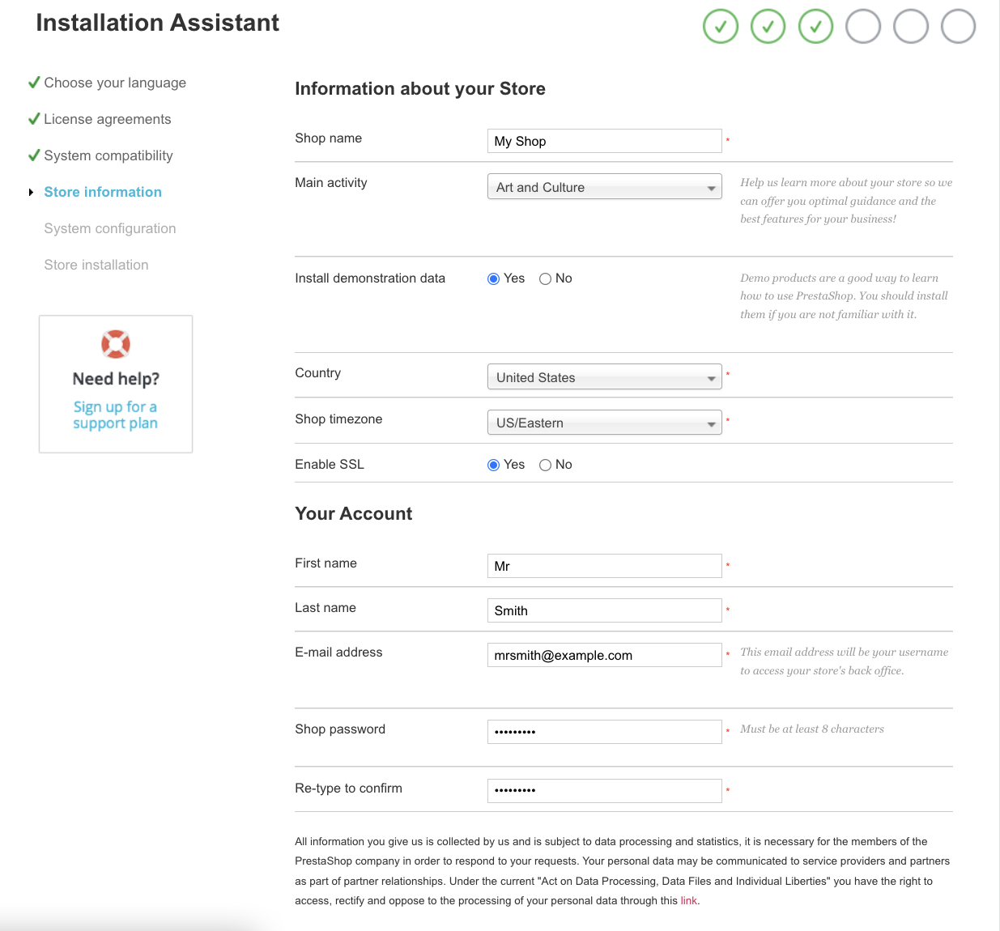
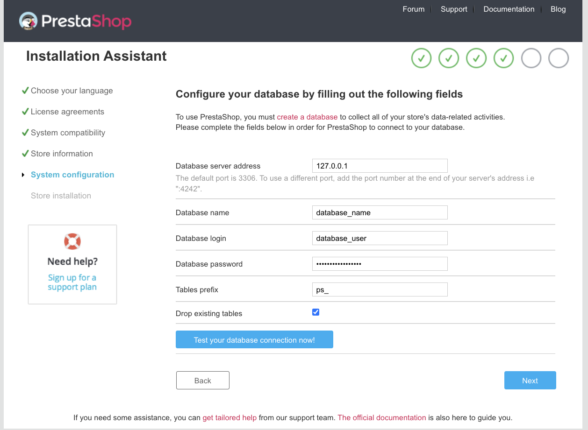
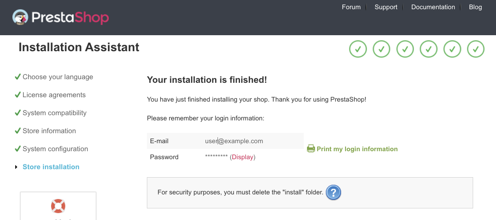
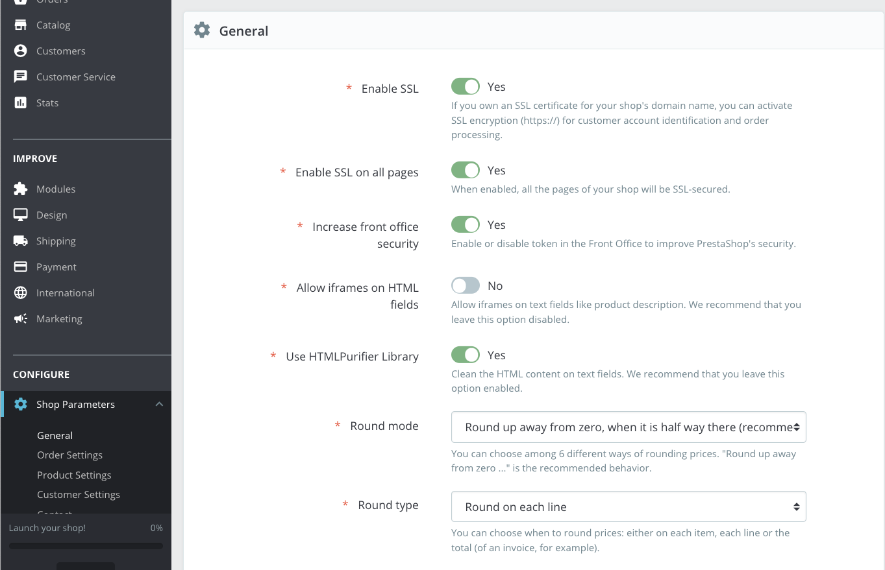
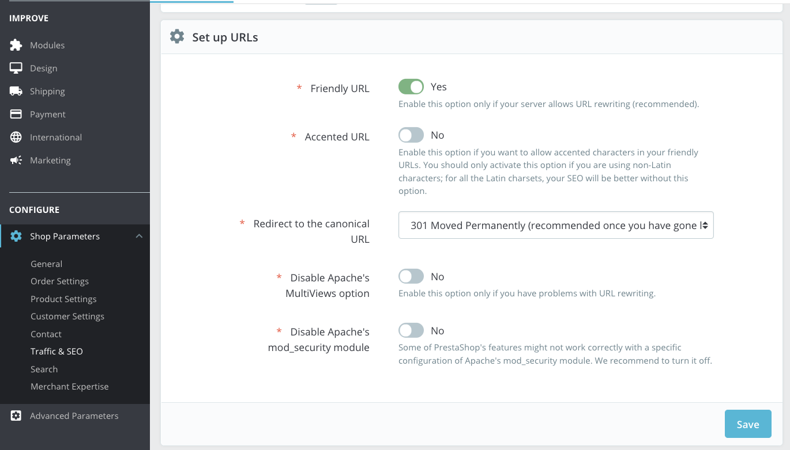
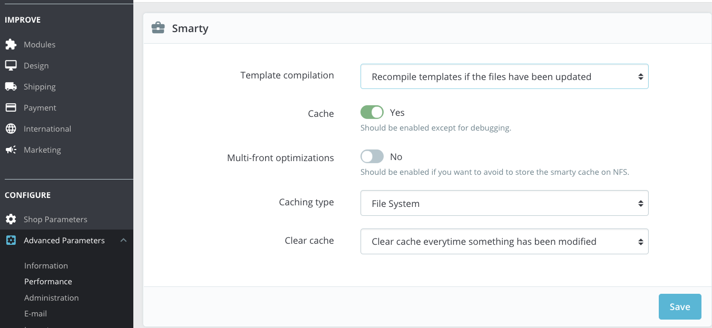
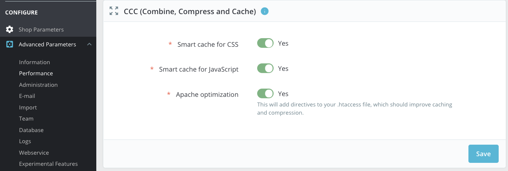
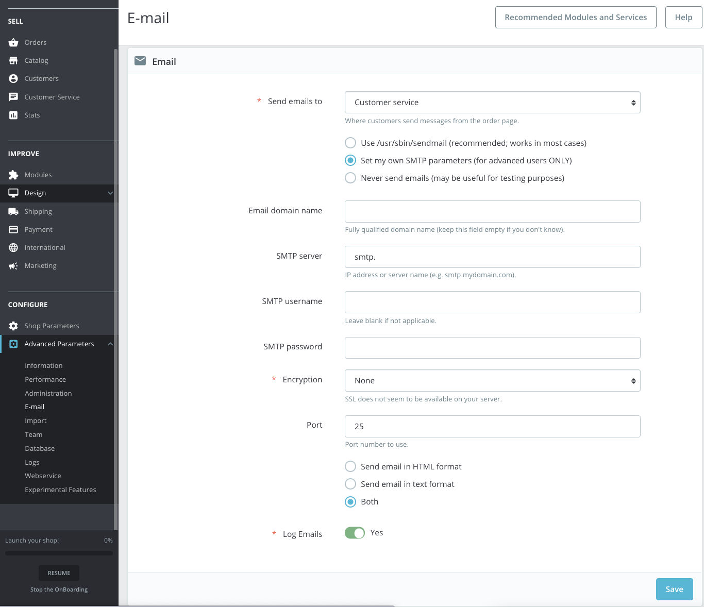

## What is PrestaShop?

If you've ever thought about opening an online store, you may have felt overwhelmed by the variety of free, open-source ecommerce solutions available. One of those options, [PrestaShop](https://www.prestashop.com/en), is the subject of this guide. PrestaShop is a comprehensive ecommerce solution used by thousands of merchants around the world.

PrestaShop's ecommerce breadth can make it seem daunting to learn; however, its menus are neatly structured, its terms are intuitive, and its interface is easily navigable. In addition, customizing your website with PrestaShop's many *What You See Is What You Get* (WYSIWYG) tools makes for a user-friendly set up, without having to inspect and edit source code. Also, PrestaShop comes with many out-of-the-box features and plug-ins that streamline setup and use.

Installing PrestaShop on a remote server is more involved and time-consuming than using cloud hosting, but the rewards are greater: you will have better performance, since you have conserved server resources, and greater flexibility, with the freedom to tweak your settings as you see fit. You won't ever have to wait for a cloud-host support team to change PHP settings for you. Furthermore, [high availability](/docs/websites/introduction-to-high-availability/), [load balancing](/docs/platform/nodebalancer/getting-started-with-nodebalancers/), advanced [backup schemes](/docs/platform/disk-images/linode-backup-service/), and other features become easily accessible, allowing you to scale your business and increase your site's reliability.

## Before You Begin

1.  Familiarize yourself with our [Getting Started](/docs/getting-started/) guide and complete the steps for setting your Linode's hostname and timezone.

2.  This guide will use `sudo` wherever possible. Complete the sections of our [Securing Your Server](/docs/security/securing-your-server/) guide to create a standard user account, harden SSH access, and remove unnecessary network services.

4.  In order to obtain a free SSL certificate from Let’s Encrypt, you will need to buy a Fully Qualified Domain Name (FQDN) and set it to point to your Linode. See our [DNS Manager Overview](https://www.linode.com/docs/guides/dns-manager/) guide for more information.

3.  Update your system:

        sudo apt update && sudo apt upgrade


This guide is written for a non-root user. Commands that require elevated privileges are prefixed with `sudo`. If you’re not familiar with the `sudo` command, see the [Users and Groups](/docs/tools-reference/linux-users-and-groups/) guide.


## PrestaShop Ubuntu Server Requirements

PrestaShop's [minimum server requirements](https://doc.prestashop.com/display/PS18/What+you+need+to+get+started) call for at least 256 MB of RAM. However, this small amount of RAM is insufficient for even a low-traffic online store. We recommend an Ubuntu 20.04 instance with at least 1 GB of RAM. Monitor RAM use as your PrestaShop store grows and scale to a bigger Linode when necessary.

## Install Apache and MariaDB

PrestaShop needs a web server and a database. This guide uses a modified LAMP stack. LAMP traditionally stands for Linux, Apache, MySQL, and PHP. Apache is the web server, and MySQL is the database. We modify that by replacing MySQL with MariaDB, a functionally equivalent fork of MySQL. If you prefer a traditional LAMP stack, see [How to Install a LAMP Stack on Ubuntu 20.04](/docs/guides/how-to-install-a-lamp-stack-on-ubuntu-20-04/).

1.  Install Apache and MariaDB:

        sudo apt install apache2 mariadb-server

2.  Secure MariaDB:

        sudo mysql_secure_installation

    The script asks a series of questions. You can skip creating a root password because we won't  log in to MariaDB remotely as root. Answer 'y' (Yes) to the other questions.

    
Enter current password for root (enter for none):
Set root password? [Y/n] n
Remove anonymous users? [Y/n] y
Disallow root login remotely? [Y/n] y
Remove test database and access to it? [Y/n] y
Reload privilege tables now? [Y/n] y
    

3.  Add firewall rules to accept HTTP and HTTPS connections. This is only necessary if you have enabled the `ufw` firewall.

        sudo ufw allow in "Apache Full"

4.  Restart Apache:

        sudo systemctl restart apache2

## Install PHP

Ubuntu's default repositories contain PHP 7.4. This is an older PHP version, but it is the newest supported by PrestaShop at the time of writing.

1.  Install the PHP FastCGI Processing Manager (php-fpm), which will also install core PHP dependencies:

        sudo apt install php7.4-fpm

2.  Enable PHP-FPM:

        a2enmod proxy_fcgi setenvif
        a2enconf php7.4-fpm

3.  Restart Apache:

        sudo systemctl restart apache2

## Configure Apache for PrestaShop

The next step creates an Apache configuration file so the web server knows what your domain name is and where to find your PrestaShop store's files.

1.  Copy the default config to use as a template. Replace `example.com` with your domain:

        sudo cp /etc/apache2/sites-available/000-default.conf /etc/apache2/sites-available/example.com.conf

2.  Edit the configuration file with your preferred text editor. Our examples use `vim`, but you can also use `nano` or another editor.

        sudo vim /etc/apache2/sites-available/example.com.conf

    Edit the following lines. If they are commented, remove the comment marker (#).

    
ServerName example.com

ServerAdmin webmaster@example.com
DocumentRoot /var/www/html/example.com
    

3.  Create the document root directory. This is where your store's files are kept:

        sudo mkdir /var/www/html/example.com

4.  Enable your site and disable the default configuration:

        sudo a2dissite 000-default.conf
        sudo a2ensite example.com.conf

5.  Restart Apache:

        sudo systemctl restart apache2

### Allow PrestaShop to Use .htaccess Files

`.htaccess` files are per directory configuration files for Apache. PrestaShop can use `.htaccess`  to configure Apache and enable features such as pretty links, redirects, and compression.

1.  Edit the configuration file

        sudo vim /etc/apache2/sites-available/example.com.conf

2.  Enter the following `<Directory` block within the `<VirtualHost>` block:

    
<Directory /var/www/html/example.com>
    AllowOverride All
</Directory>


## Encrypt PrestaShop Traffic with TLS (SSL)
Ecommerce customers expect to connect to online stores over an encrypted connection enabled by a digital certificate. The certificates are colloquially referred to as SSL certificates, but are more properly known as TLS certificates. Browsers label insecure any store without a certificate, which is unlikely to inspire trust in your customers.

This guide explains how to install a free Let's Encrypt SSL certificate. Let's Encrypt issues Domain Validation (DV) certificates. DV certificates are adequate for small stores, but as your store grows, you should consider replacing the Let's Encrypt certificate with an Organization Validation (OV) or Extended Validation (EV) certificate. OV and EV certificates require more thorough identity validation and are therefore more trusted.

1.  Install the `snapd` package (it may be installed already):

        sudo apt install snapd
        sudo snap install core
        sudo snap refresh core

2.  Use `snap` to install `certbot`:

        sudo snap install --classic certbot

3.  Use `certbot` to request and install an SSL certificate. `certbot` asks a series of questions, including which domain to configure. It then adds directives to the site's configuration file to enable the certificate and redirect traffic to HTTPS.

        sudo certbot --apache

## Prepare Ubuntu 20.04 for PrestaShop

1.  Set ownership of `/var/www/html/example.com`to allow PrestaShop to enable plug-ins, automatic updates, and other features.

        sudo chown www-data:www-data /var/www/html/example.com/

2.  Navigate to the store's directory:

        cd /var/www/html/example.com/

3.  Download the PrestaShop files. Visit PrestaShop's [download page](https://www.prestashop.com/en/download) to find the most recent version. At the time of writing it's `1.7.8.1`. Adapt the following commands as necessary to use the most recent version.

        sudo curl -O https://download.prestashop.com/download/releases/prestashop_1.7.8.1.zip

4.  Install the `unzip` package:

        sudo apt install unzip

5.  Unzip the PrestaShop package:

        sudo unzip prestashop_1.7.8.1.zip

## Install PrestaShop on Ubuntu 20.04

1.  Install PrestaShop's PHP dependencies:

        sudo apt install php7.4-curl php7.4-gd php7.4-mysql php7.4-zip php7.4-xml php7.4-intl php7.4-mbstring

2.  Enable Apache's `rewrite` module (it may already be enabled):

        sudo a2enmod rewrite

3.  Restart Apache:

        sudo systemctl restart apache2

4.  Create a MariaDB database and user for PrestaShop. Log in to MariaDB as the root user:

        sudo mysql

5.  Enter the following SQL at the MariaDB shell. Replace `database_name`, `database_user`, and `database_password` with suitable values for your store.

        CREATE DATABASE database_name;
        CREATE USER 'database_user'@'localhost' IDENTIFIED BY 'database_password';
        GRANT ALL ON database_name.* TO 'database_user'@'localhost';
        exit

6.  Navigate to `https://example.com` in a browser. An install wizard guides you through the installation process. Complete the first form to name your store and create an account. Ensure the "Enable SSL" option is selected.

     

7.  Enter the database credentials you created in the previous section. Use `127.0.0.1` as the database server address. This is the localhost or loopback IP address, which is used because PrestaShop and the MariaDB database are installed on the same server.

    

7.  Test your connection to the database server.

8.  After you click next, the installer creates the necessary tables and finalizes setting up the store. You will see a page that looks something like this:

      

9.  Leaving the installation directory and zip file in place may create a security risk, so we delete them:

        sudo rm -r install prestashop_1.7.8.1.zip

## Optimize PrestaShop and Verify SSL

In this section, we suggest several optimizations that improve PrestaShop security and performance.

1.  Visit `https://example.com/admin` and log in with the user you created in the previous section.

2.  Verify SSL is properly configured. If you installed a TLS certificate with `certbot`, secure connections should already be configured. Verify by choosing *Configure -> Shop Parameters -> General* in the sidebar menu. Both "Enable SSL" and "Enable SSL on all pages" should be activated.

    

3.  Select *Configure -> Shop Parameters -> Traffic and SEO* from the sidebar menu. Scroll down until you find the settings in the image below. Turn on "Friendly URL".

    Then, select *301 Moved Permanently* from the drop-down menu labelled *Redirect to the canonical URL*.

    

4.  PrestaShop includes performance optimizations that help pages to load faster for shoppers. Navigate to *Configure -> Advanced Parameters -> Performance* in the sidebar menu.

    In the *Template Compilation* drop-down menu, select *Recompile templates if the files have been updated*.

    Additionally, enable the *Cache* option. Caching reduces PHP code execution and database requests, decreasing front-end load times.

    

5.  Scroll to the *CCC (Combine, Compress and Cache)* section of the Performance page. Turn on each option.

    

6.  Finally, tweak the PHP configuration to increase allowed upload sizes.

        sudo vim /etc/php/7.4/fpm/php.ini

    Search for the `upload_max_filesize` option and change it to 10M. This will allow you to upload larger product images.

    
upload_max_filesize = 10M


    There are two other settings you you may need to change in the future as your store grows. If you notice increased memory use or degraded performance, consider increasing `memory limit` and `max_execution_time` .

    
memory_limit = 128M
max_execution_time = 30


7.  Restart Apache so your changes take effect:

        sudo systemctl restart apache2

## Set Up PrestaShop Mail Delivery on Ubuntu



Setting up mail delivery in PrestaShop is vital because so much happens through email: customer account confirmations, subscriptions, delivery statuses, order confirmations, etc. Although an email server [like this one](/docs/email/postfix/email-with-postfix-dovecot-and-mysql/) can be hosted on a Linode, it can be complicated to set up and maintain.

It's also possible to use an all-in-one solution like [Mail-in-a-Box](/docs/email/how-to-create-an-email-server-with-mail-in-a-box/), but the easiest approach is to use a dedicated solution like [Google Workspace](/docs/guides/using-google-workspace-for-email/) or [Fastmail](https://www.fastmail.com/). This way you can focus on maintaining your store and get dependable email service without worrying about the technical details.

Once you have decided on an email provider, configure PrestaShop's email system: in the left sidebar menu, under *CONFIGURE -> Advanced Parameters -> E-mail*. Once the page loads, look for *Set my own SMTP parameters (for advanced users ONLY)*.

## Next Steps

Now that you have PrestaShop up and running, you can begin to customize the site to meet the needs of your store. The official PrestaShop site has a list of [modules](https://addons.prestashop.com/en/) that can be installed to add features such as online chat, SEO optimization, and product statistics. It is also important to maintain the security of your site. Make sure to frequently update PrestaShop, any installed modules or plug-ins, as well as your Linode system.